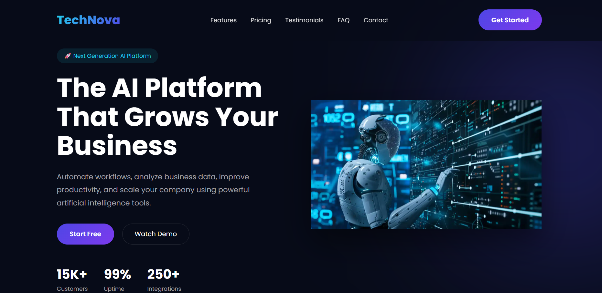

# 🚀 TechNova AI — Modern SaaS Landing Page

A modern and responsive AI SaaS website designed for a professional technology and artificial intelligence company.

The project focuses on futuristic visual design, interactive frontend features, responsive layouts, and a modern user experience suitable for SaaS startups and technology brands.

## 🌐 Live Demo

My live demo link here:

 https://mohammedalesay47-prog.github.io/technova-ai/

## 📸 Preview

## ✨ Features

* Modern AI SaaS focused design
* Futuristic dark theme
* Responsive layout
* Mobile navigation menu
* Hero section with call-to-action buttons
* Trusted companies section
* AI features showcase
* How It Works section
* Animated statistics counters
* Dashboard showcase section
* Pricing plans
* Popular pricing plan highlight
* Customer testimonials
* FAQ section
* Contact form
* Smooth scrolling
* Scroll reveal animations
* Hover animations
* Back-to-top button
* Mobile, tablet and desktop support

## 🛠️ Technologies

* HTML5
* CSS3
* JavaScript
* Font Awesome
* Google Fonts

## 📂 Project Structure

technova-ai/
│
├── index.html
├── style.css
├── script.js
├── README.md
├── preview.png
│
└── images/
    ├── hero.png
    ├── dashboard.png
    ├── testimonial1.jpg
    ├── testimonial2.jpg
    └── testimonial3.jpg

🎨 Design

The website uses a futuristic dark technology aesthetic with gradient colors and glassmorphism effects.

Main Colors
Primary: #4F46E5
Secondary: #7C3AED
Accent: #22D3EE
Background: #070B18
Card: rgba(255,255,255,.08)
Text: #FFFFFF
Gray: #A1A1AA
📱 Responsive Design

The website is optimized for:

Desktop
Laptop
Tablet
Mobile devices
🤖 AI SaaS Sections

The project includes different sections representing a modern AI platform:

AI-powered hero presentation
Feature solutions
Workflow explanation
Analytics dashboard showcase
Subscription plans
Customer feedback
Frequently asked questions
💳 Pricing Plans

The project includes three sample pricing plans:

Starter — $19/month
Professional — $49/month
Enterprise — $99/month

The Professional plan is visually highlighted as the most popular option.

Pricing plans are fictional and used for demonstration purposes.

👥 Testimonials

The project includes fictional customer testimonials representing SaaS users and technology companies.

All names and reviews are created for portfolio demonstration purposes only.

🎯 Project Purpose

This project was created as a professional frontend portfolio project to demonstrate:

Responsive web development
Modern SaaS website design
UI/UX principles
CSS animations and transitions
JavaScript DOM interaction
Interactive frontend functionality
Business website development
⚠️ Demo Disclaimer

All companies, statistics, prices, testimonials, and information shown in this project are fictional and are used for portfolio and demonstration purposes only.

👨‍💻 Author

Mohammed Alesay

Frontend Developer

GitHub:

https://github.com/mohammedalesay47-prog

📄 License

This project was created for portfolio and demonstration purposes.
